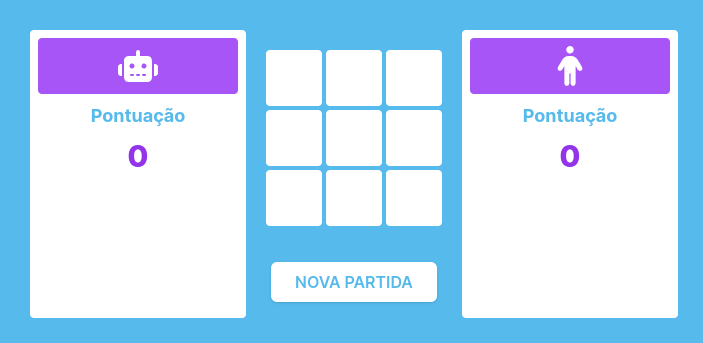
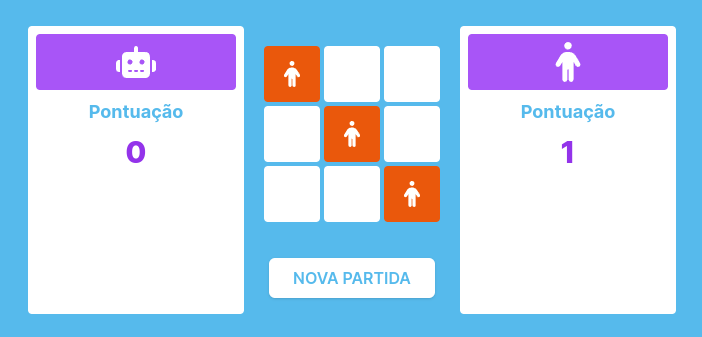
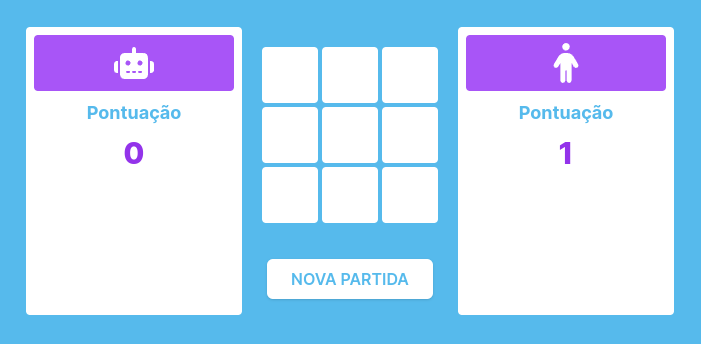
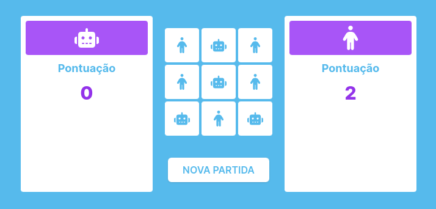

# Jogo-da-Velha-NextJS

Jogo da Velha, utilizando [Next.js](https://nextjs.org/)

## Getting Started

Primeiro, execute o servidor de desenvolvimento:

```bash
npm run dev
# ou
yarn dev
# ou
pnpm dev
# ou
bun dev
```

Abra [http://localhost:3000](http://localhost:3000) com seu navegador para ver o resultado.

##








